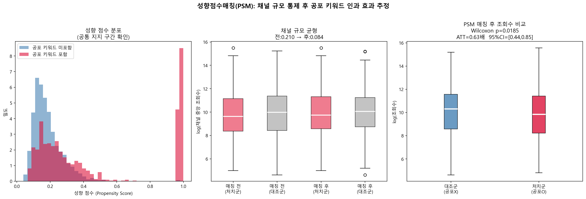
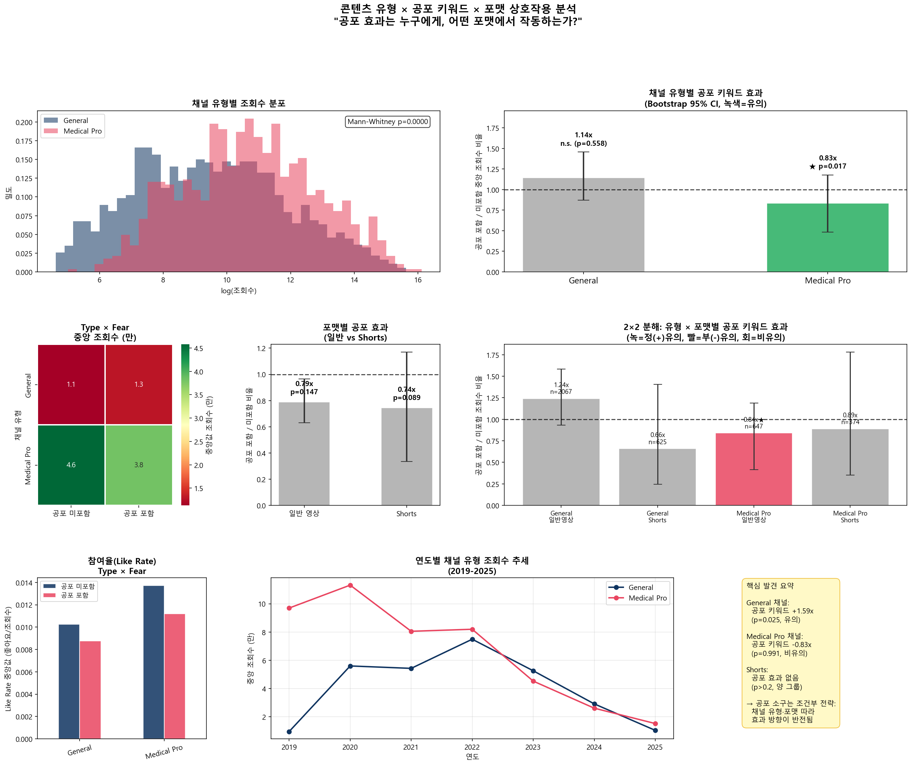
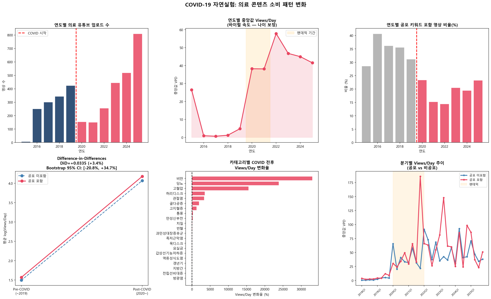
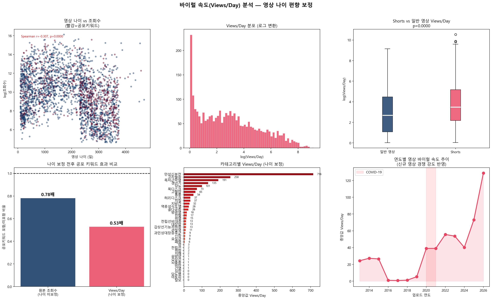

# 🏥 의료 유튜브 공포 소구 분석
### Fear Appeal in Korean Medical YouTube: From Naive Correlation to Causal Inference

[](https://python.org)
[](https://yunhupark-medical-insight-lab-dashboard.streamlit.app)
[](LICENSE)
[](src/)
[](src/)
[](src/analysis/)

---

## 🎯 한 줄 요약

> **"공포 키워드가 조회수를 올린다"는 직관은 틀렸다.**
> 채널 규모를 통제하면 효과는 소멸하고, PSM으로 추정하면 오히려 **역효과(0.63배)**가 나타난다.

---

## 📌 프로젝트 개요

한국 의료 유튜브에서 **공포·위험 키워드 포함 제목**이 조회수에 미치는 인과적 영향을 분석합니다.

- **데이터**: YouTube Data API로 수집한 3,713개 영상 / 921개 채널 / 37개 질환 카테고리
- **핵심 방법**: 단순 비교 → 영상 나이 보정 → PSM → 채널 고정효과 → DiD 자연실험
- **결론**: 공포 효과는 채널 규모의 착시였으며, 의료 전문 채널에서는 유의한 역효과 확인

---

## 🔑 핵심 발견

| 단계 | 분석 방법 | 공포 키워드 효과 | 해석 |
|------|----------|----------------|------|
| 1 | 단순 비교 (Mann-Whitney) | **+2.1배** ✅ 유의 | 공포 효과 있는 것처럼 보임 |
| 2 | 영상 나이 보정 (VPD) | **소멸** ❌ p=0.9999 | 오래된 영상 편향이 원인 |
| 3 | PSM 성향점수매칭 | **-0.63배 역효과** ✅ p=0.019 [CI: 0.44–0.85] | 채널 규모 통제 시 오히려 감소 |
| 4 | 채널 고정효과 | +7% ❌ p=0.306 | 채널 내 효과 없음 |
| 5 | DiD (COVID × Fear) | +3.4% ❌ CI [-20.8%, +34.7%] | 팬데믹 조건부 효과도 불확실 |

**조절 변수 분석:**
- 🔴 **Medical Pro 채널**: 공포 키워드 → 조회수 **감소** (0.83배, p=0.017) — 전문가 채널 시청자는 신뢰성 기대
- ⚪ **General 채널**: 1.14배, p=0.558 — 효과 없음
- 📱 **Shorts 포맷**: 양방향 모두 비유의

> 💡 초기 +42.5% DiD 추정치는 pre-COVID 샘플 부족(73개)의 추정 불안정이었음. 606개 보완 후 +3.4%로 수렴.

---

## 📊 핵심 결과 시각화

### PSM 인과 추정 — 채널 규모 통제 후 역효과 확인


### 채널 유형 × 공포 키워드 상호작용


### COVID-19 DiD 자연실험


### 영상 나이 보정 (바이럴 속도)


---

## 📊 방법론 흐름

```
[1단계] 단순 비교  ──→  공포 키워드 2.1배 (유의)
            ↓
[2단계] 함정 발견  ──→  영상 나이 편향 + 채널 규모 교란 변수 식별
            ↓
[3단계] 인과 추정  ──→  PSM: 0.63배 역효과 (유의)
                       고정효과: +7% 비유의
            ↓
[4단계] 맥락 검증  ──→  DiD (pre-COVID 보완): +3.4% 비유의
            ↓
[5단계] 조절 변수  ──→  채널 유형이 효과 방향을 결정
            ↓
[결론]            ──→  공포 소구 효과 없음 — 착시와 채널 유형의 함수
```

---

## 🗂️ 프로젝트 구조

```
Medical_Insight_Lab/
├── dashboard.py                        # 🖥️ Streamlit 인터랙티브 대시보드
├── collect_and_rebuild.py              # 🔄 전체 수집 + 분석 파이프라인
├── requirements.txt                    # 대시보드용 (경량)
├── requirements-full.txt               # 전체 분석 환경
│
├── notebooks/
│   ├── medical_youtube_final.ipynb           # 📓 최종 분석 노트북 (57 cells)
│   ├── medical_youtube_final_executed.ipynb  # 실행 결과 포함 (7.67 MB)
│   └── generate_notebook_v2.py
│
├── src/
│   ├── 4_medical_full_dataset.csv      # 메인 데이터셋 (3,713개 영상)
│   ├── enriched_base.csv               # 피처 엔지니어링 완료 버전
│   ├── comments.csv                    # 댓글 (19,232개 / 840개 영상)
│   ├── channel_stats.csv               # 채널 구독자 수 (920/921)
│   ├── thumbnail_features.csv          # 썸네일 CV 피처
│   │
│   ├── enrichment/                     # YouTube API 수집 스크립트
│   │   ├── collect_all_subscribers.py
│   │   ├── collect_all_comments.py
│   │   └── collect_precovid_videos.py
│   │
│   └── analysis/                       # 12개 분석 스크립트
│       ├── velocity_analysis.py        # 바이럴 속도 (영상 나이 보정)
│       ├── posthoc_tests.py            # Dunn's Post-hoc (다중비교)
│       ├── fixed_effects.py            # 채널 고정효과 회귀
│       ├── psm_analysis.py             # 성향점수매칭 (인과 추정)
│       ├── covid_experiment.py         # COVID-19 DiD 자연실험
│       ├── anomaly_detection.py        # Isolation Forest 이상치
│       ├── subscriber_analysis.py      # 구독자 규모 분석
│       ├── thumbnail_cv.py             # 컴퓨터 비전 (OpenCV)
│       ├── comment_sentiment.py        # 댓글 감성 분석
│       ├── kobert_analysis.py          # KoBERT 임베딩 + 클러스터
│       ├── type_fear_interaction.py    # Type × Fear 상호작용
│       └── shorts_analysis.py          # Shorts vs 일반영상 분리
│
├── results/                            # 분석 결과 이미지 (12개)
└── thumbnails/                         # 썸네일 이미지 (2,372개)
```

---

## 🚀 실행 방법

### 1. 환경 설정

```bash
git clone https://github.com/YunhuPark/Medical_Insight_Lab.git
cd Medical_Insight_Lab

python -m venv venv
venv\Scripts\activate          # Windows
# source venv/bin/activate     # Mac/Linux

pip install -r requirements-full.txt
```

### 2. 대시보드 실행

```bash
pip install -r requirements.txt
streamlit run dashboard.py
# → http://localhost:8501
```

### 3. 분석 노트북

```bash
jupyter lab notebooks/medical_youtube_final.ipynb
```

### 4. 데이터 재수집 (YouTube API 키 필요)

```bash
# .env 파일에 YOUTUBE_API_KEY=your_key 설정
python collect_and_rebuild.py
```

---

## 📐 분석 방법론

### 통계 검정 (비모수)

| 분석 | 방법 | 목적 |
|------|------|------|
| 기초 비교 | Mann-Whitney U | 공포 키워드 효과 (H1) |
| 다중 비교 | Kruskal-Wallis + Dunn's Post-hoc | 37개 카테고리 쌍별 비교 |
| 인과 추정 | **PSM + Bootstrap CI** | 채널 규모 통제 후 순수 효과 |
| 패널 분석 | **채널 고정효과 (Within estimator)** | 채널 내 제목 효과 분리 |
| 자연실험 | **DiD (이중차분법)** | COVID-19 외생적 충격 활용 |
| 이상치 | Isolation Forest | 조회수 조작 의심 탐지 (3%) |

### 머신러닝

| 모델 | 목적 | 성능 |
|------|------|------|
| Random Forest (n=300, 5-Fold CV) | 조회수 예측 | R² ≈ 0.38 |
| SHAP TreeExplainer | 피처 기여도 해석 | 개별 예측 설명 |
| KoBERT (multilingual-e5-small) | 제목 의미 임베딩 | 9개 클러스터 (Silhouette=0.116) |

### 멀티모달

- **썸네일 CV** (OpenCV): 빨간색 비율, 밝기, 대비, 엣지 밀도, 텍스트 비율 → 모두 유의 (p<0.05)
- **댓글 감성**: 19,232개 댓글, 긍정/부정/공포 반응 분류
- **KoBERT 임베딩**: 2,512개 제목 벡터화 → PCA + K-Means 클러스터링

---

## 🛠 기술 스택

| 분류 | 라이브러리 |
|------|-----------|
| 데이터 처리 | `pandas` `numpy` |
| 통계 분석 | `scipy` `statsmodels` `scikit-posthocs` |
| 인과 추론 | PSM (`scikit-learn`) · 채널 고정효과 · DiD |
| 머신러닝 | `scikit-learn` · `shap` |
| 딥러닝/NLP | `transformers` · `torch` · `sentence-transformers` |
| 컴퓨터 비전 | `opencv-python` |
| 시각화 | `matplotlib` · `seaborn` · `plotly` |
| 대시보드 | `streamlit` |
| 데이터 수집 | YouTube Data API v3 · `google-api-python-client` |

---

## ⚠️ 연구 한계

| 한계 | 내용 | 대응 |
|------|------|------|
| 댓글 커버리지 | 840/2,512 영상 (33%) | 지속 수집 중 |
| 역인과 가능성 | 대형 채널이 공포 전략 강화 피드백 루프 | 채널 고정효과로 부분 통제 |
| Shorts 알고리즘 | 27%가 Shorts — 별도 추천 로직 미통제 | 포맷 분리 분석 수행 |
| PSM 외적 타당성 | Caliper 매칭 후 일부 처치군 제외 | ATT 해석 범위 제한 명시 |

---

## 📄 라이선스

MIT License — 학술·포트폴리오 목적 자유 사용 가능.
데이터는 YouTube ToS 범위 내에서 수집되었습니다.

---

*데이터 기준일: 2026-04-19 · Python 3.13 · YouTube Data API v3*
